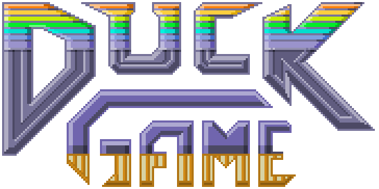
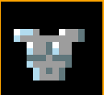

# Manual de Usuario



## 1. Instalacion de dependencias y compilacion

Para instalar las dependencias necesarias para el correcto funcionamiento del programa, se debe ejecutar el siguiente comando en la terminal:

```bash
chmod +x install_all.sh
sudo ./install_all.sh
```

Una vez esto, se debe compilar el programa. Para esto se debe ejecutar el siguiente comando en la terminal:

```bash
chmod +x build_game.sh
./build_game.sh
```

## 2. Ejecucion del juego

Para poder ejecutar el juego primero se va a tener que ejecutar el servidor y luego el cliente:

```bash
./SERVER <puerto>
```

Luego para ejecutar el cliente se debe ejecutar el siguiente comando:

```bash
./CLIENT <host> <puerto>
```

Para ejecutar localmente se recomienda que host sea localhost y el puerto sea el mismo para ambos. Por ejemplo:

```bash
./SERVER 8080
./CLIENT localhost 8080
```

Una vez hecho esto, se ejecutara y se abrira el lobby del juego.

Tambien se puede ejecutar el editor del juego, para esto se debe ejecutar el siguiente comando en la terminal:

```bash
./EDITOR
```

## 3. Interfaz del Lobby

Una vez empieze la ejecucion se mostrara el siguiente menu:


Tendremos 3 opciones:

- Crear una partida.
- Unirse a una partida.
- Salir del juego.

Para crear una partida se debe apretar el boton Create. Una vez hecho esto tendremos este menu:


Podremos ponerle un nombre a la partida para que los demas jugadores puedan unirse e identicarla. Tambien podremos elegir la cantidad de jugadores que queremos que haya en la partida. Ademas deberemos la cantidad de jugadores locales que queremos que haya en la partida. Una vez hecho esto se debe apretar el boton Connect. Si se quiere volver atras se debe apretar el boton Volver.

Para unirse a una partida se debe apretar el boton Join. Una vez hecho esto tendremos este menu:


Se mostraran todas las partidas que estan disponibles para unirse. Se debe apretar, para unirse a una partida, se debe hacer click en la partida deseada. Si se quiere volver atras se debe apretar el boton Volver. Podemos apretar el boton Refresh para actualizar la lista de partidas.
Una vez que decidimos unirnos a una partida se nos mostrara el siguiente menu:


Vemos que nos deja seleccionar la cantidad de jugadores locales que queremos que haya en la partida. Puede ocurrir que no nos deje seleccionar 2 jugadores locales si la partida solo le queda un lugar. Una vez seleccionado la cantidad de jugadores locales se debe apretar el boton Connect.

Una vez hecho todos estos pasos se nos mostrara el siguiente menu:


En este menu se nos mostrara la cantidad de jugadores que hay en la partida, indicando su nombre, su ID y su color. El anfitrion de la partida podra iniciar la partida apretando el boton Iniciar Juego mientras que los demas jugadores no podran hacer esto y deberan espera a que el anfitrion inicie la partida.

## 4. Juego

### Controles del juego

Una vez que se inicie la partida se mostrara el juego. Una vez comienze seras un pato. Podras hacer los siguientes movimientos:

- Flecha derecha e izquierda para mover
- Flecha de arriba para saltar
- Flecha de abajo para hacerse el muerto
- Coma (,) para disparar
- Punto (.) para agarrar un arma 
- Guion (-) para soltar un arma
- Mantener flecha de arribar para aletear
- L para apuntar hacia arriba

Si se activa el modo de 2 jugadores locales, el segundo jugador podra hacer los mismos movimientos pero con las teclas:

- A, D para moverse.
- W para saltar.
- S para hacerse el muerto.
- G para disparar.
- F para soltar el arma.
- H para recoger armas, armaduras y cascos.
- Mantener W para aletear.
- Y para apuntar hacia arriba.

### Objetivo del juego

El objetivo del juego es ser el ultimo pato en pie. Para esto debera matar el resto de los patos y sobrevivir. Una vez que un pato gane o todos mueran en el mismo instante,
comenzara una nueva ronda y el mapa cambiara. Cada 5 rondas se le informaran a los patos cuantas victorias tiene cada uno. Si algun pato gana 10 o mas rondas, se declarara ganador y terminara el juego.
Esto ocurrira una vez que se verifique las victorias cada 5 rondas.

## 5. Server

Para poder cerrar el servidor se debe mandar por consola la letra q en la terminal.

## 6. Como usar el editor para crear tus mapas o modificar los existentes

El editor es una herramienta que permite crear mapas para el juego. Se pueden crear mapas de dimensiones personalizadas. Es clave que los mapas tengan un tamaño acorde, se recomienda que el tamaño sea de 30x40. Esto se puede modificar en el archivos de configuraciones que se encuentra en common/configs/configurations.yaml. No se recomienda poner dimensiones muchos mas grandes que estas ni mucho mas chicas. Esto puede generar problemas en la visualizacion del mapa.

Una vez que se abre el editor se mostrara el siguiente menu:


Para poder colocar las estructuras se debera clickear en la estructura deseada y luego clickear en el mapa en la ubicacion deseada. Si se desea borrar una estructura se debera clickear el boton eraiser y luego clickear en la estructura que se desea borrar. 0

### Estructuras disponibles:

Tendremos multiples estructuras disponibles para colocar en el mapa. Estas son:

- Plataformas: Se pueden colocar plataformas en el mapa. Estos son necesarios para que los jugadores puedan caminar por el mapa. Asi como se pueden de forma apilada para generar una estructura mas alta.

- Spawn: Se puede colocar un spawn en el mapa. Este es el lugar donde los jugadores apareceran al inicio de la partida. Se debe tener en cuenta que el pato tiene 2 bloques de alto, se coloca de esta forma por un tema de simplicidad y mejor comprension.Este es representado asi:


- Armaduras y cascos: Se pueden colocar armaduras y cascos en el mapa. Estos son necesarios para que los jugadores puedan recogerlos y asi tener mas vida y proteccion. Estos son representados asi:

    

- Armas: Se pueden colocar spawners de armas aleatorias en el mapa. Estos son necesarios para que los jugadores puedan recogerlas y asi poder disparar. Estos son representados asi:


- Cajas: Se pueden colocar cajas en el mapa. Estos son necesarios para que los jugadores puedan romperlas y asi obtener armas, armaduras y cascos. Estos son representados asi:


### Guardar y cargar mapas

Para guardar un mapa se debe apretar el boton Save. Se nos abrira nuestro sistema de archivos del sistema operativo y se nos pedira que pongamos un nombre al mapa. Se debe poner el nombre con extension .yaml. Por ejemplo: mapa1.yaml. Para poder jugar el mapa se debe poner el archivo en la carpeta server/logic/maps. 

Para cargar un mapa se debe apretar el boton Load. Se nos abrira nuestro sistema de archivos del sistema operativo y deberemos seleccionar el archivo que queremos cargar. Si queremos cargar un mapa que ya esta en la carpeta server/logic/maps se debe seleccionar el archivo y apretar el boton Open. Despues podremos modificarlo y guardarlo con otro como sobreescribir el existente usando la opcion Save.

### Seleccionar el fondo

Se puede seleccionar el fondo que se desea que tenga el mapa. Para esto se debe elegir el fondo haciendo click y seleccionando el fondo deseado de esta forma:


Donde se desplagara las siguientes opciones y podra elegir:

