# 🦆 **Manual de Usuario - Duck Game**


---

## **1️⃣ Instalación de Dependencias y Compilación**

### 🛠️ Instalación:
Ejecuta el siguiente comando en la terminal para instalar todas las dependencias necesarias:
```bash
chmod +x install_all.sh
sudo ./install_all.sh
```

### 🔨 Compilación:
Una vez completada la instalación, compila el programa con el siguiente comando:
```bash
chmod +x build_game.sh
./build_game.sh
```

---

## **2️⃣ Ejecución del Juego**

### 🌐 **Servidor:**
Primero, inicia el servidor:
```bash
./SERVER <puerto>
```

### 👥 **Cliente:**
Luego, inicia el cliente:
```bash
./CLIENT <host> <puerto>
```

Para una ejecución local, usa `localhost` como host y un puerto común, por ejemplo:
```bash
./SERVER 8080
./CLIENT localhost 8080
```

### ✏️ **Editor del Juego:**
Para abrir el editor de mapas, ejecuta:
```bash
./EDITOR
```

---

## **3️⃣ Interfaz del Lobby**

Al ejecutar el juego, verás el siguiente menú inicial:

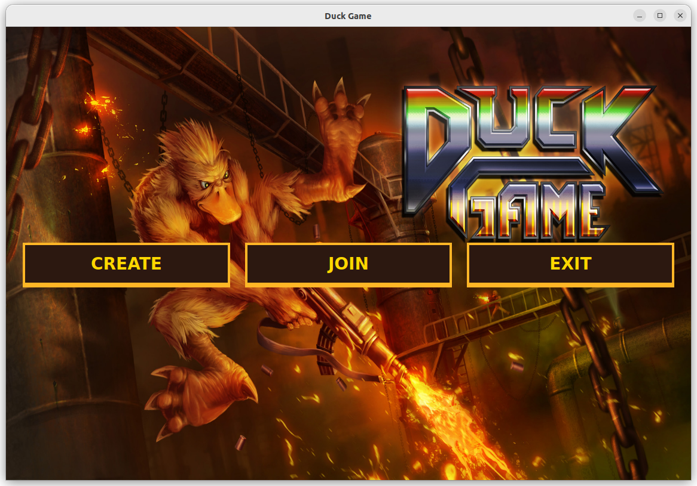

### Opciones disponibles:
1. **Crear una partida**: Presiona `Create`.
   - Introduce un nombre para la partida.
   - Elige el número de jugadores totales y locales.
   - Haz clic en `Connect` para iniciar.

   **Ejemplo del menú de creación:**
   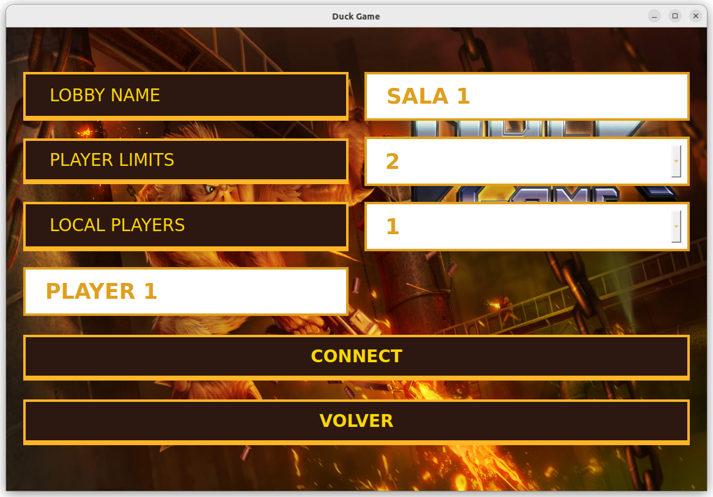

2. **Unirse a una partida**: Presiona `Join`.
   - Selecciona una partida de la lista.
   - Configura el número de jugadores locales.

   **Ejemplo del menú para unirse:**
   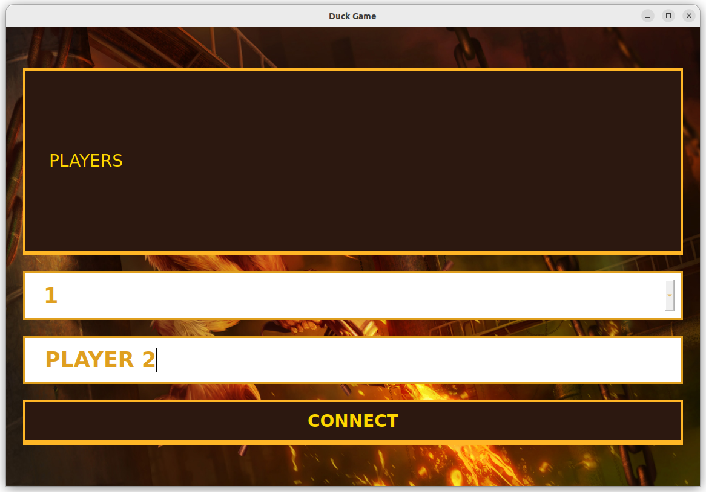

3. **Salir del juego**: Presiona `Exit`.

Una vez que todos los jugadores estén conectados, el anfitrión podrá iniciar la partida desde este menú:
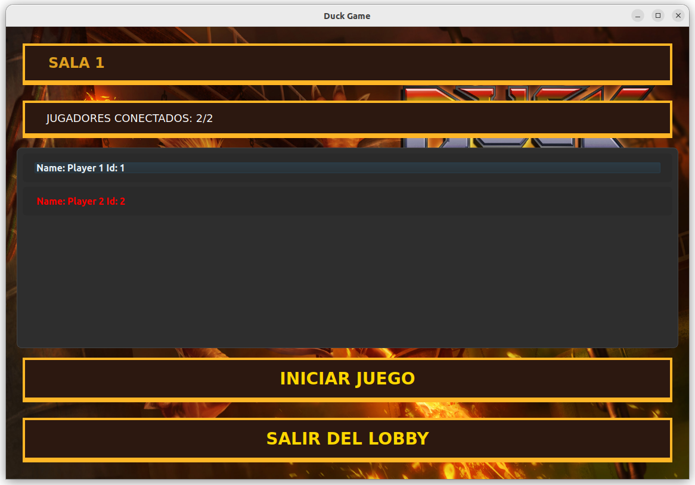

El color de tu pato sera el mismo que el color de tu nombre en el lobby.

---

## **4️⃣ Juego**

### 🎮 **Controles del Juego**

| **Acción**                     | **Jugador 1**       | **Jugador 2**       |
|---------------------------------|---------------------|---------------------|
| Moverse                         | → ← (flechas)       | A, D                |
| Saltar                          | ↑                   | W                   |
| Hacerse el muerto               | ↓                   | S                   |
| Disparar                        | `,`                 | G                   |
| Agarrar arma/objeto             | `.`                 | H                   |
| Soltar arma                     | `-`                 | F                   |
| Aletear (mantener)              | ↑                   | W                   |
| Apuntar hacia arriba            | L                   | Y                   |

---

### 🎯 **Objetivo del Juego**

¡Sé el último pato en pie! 💥  
- Derrota a los demás jugadores y se el último en pie.  
- Gana 10 rondas o más para convertirte en el campeón.

---

## **5️⃣ Servidor**

Para cerrar el servidor, escribe `q` en la terminal donde fue ejecutado.

---

## **6️⃣ Uso del Editor de Mapas**

El editor te permite crear o modificar mapas personalizados. Sigue estos pasos:

### ✨ **Interfaz Principal del Editor:**
Al iniciar el editor, verás este menú:
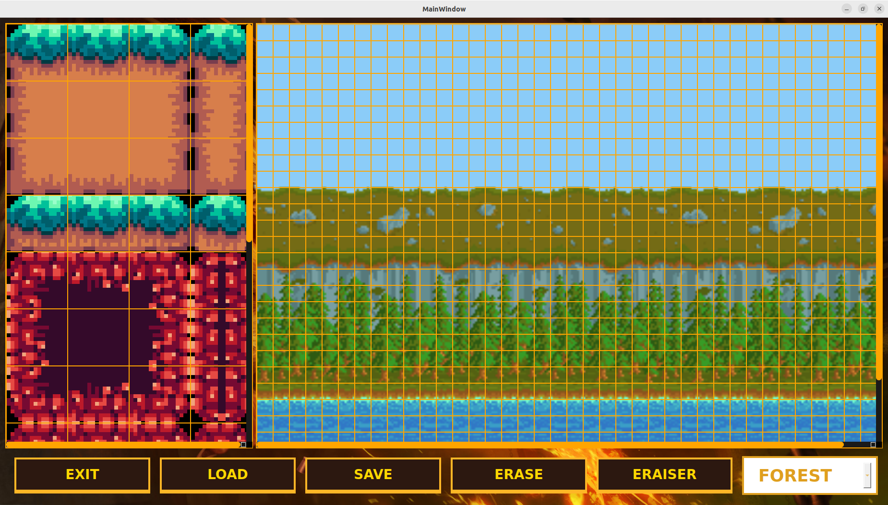

### 🧱 **Colocación de estructuras:**
1. Haz clic en el objeto deseado (plataforma, spawn, etc.).
2. Colócalo en el mapa haciendo clic en la posición deseada.
3. Para borrar una estructura, selecciona `Eraser` y haz clic en la estructura a eliminar.

---

### 🛠️ **Estructuras Disponibles**

| **Tipo**          | **Descripción**                                                                                             | **Imagen**                                   |
|--------------------|-----------------------------------------------------------------------------------------------------------|---------------------------------------------|
| **Plataformas**    | Permiten que los jugadores caminen y salten sobre ellas.                                                  | 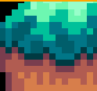                             |
| **Spawn**          | Punto donde aparecen los jugadores al inicio.                                                             | 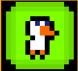  |
| **Armaduras**      | Proveen protección adicional a los jugadores.                                                             |  |
| **Cascos**         | Proveen resistencia adicional.                                                                            | 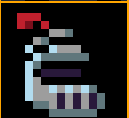  |
| **Armas**          | Spawners de armas aleatorias que los jugadores pueden recoger.                                           | 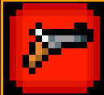  |
| **Cajas**          | Contienen objetos como armas, armaduras y cascos.                                                        | 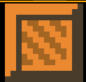 |

---

### 💾 **Guardar y Cargar Mapas:**

- **Guardar**: Haz clic en `Save`, elige un nombre y usa la extensión `.yaml`.
  Coloca el archivo en `server/logic/maps` para que sea jugable.

- **Cargar**: Haz clic en `Load` y selecciona un archivo existente.

---

### 🌄 **Selección de Fondo:**
Puedes personalizar el fondo del mapa desde este menú:


Selecciona entre las opciones disponibles:
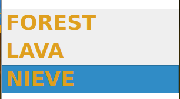


##  **7️⃣ Configuración**

Si se desea cambiar la configuración del juego, se puede hacer modificando el archivo `common/configs/configurations.yaml`. Este archivo contiene configuraciones para las armas, los patos como para las dimensiones del editor. Se recomienda no poner dimensiones muy grandes para el editor. Se recomienda usar valores cercanos a los que ya están en el archivo.